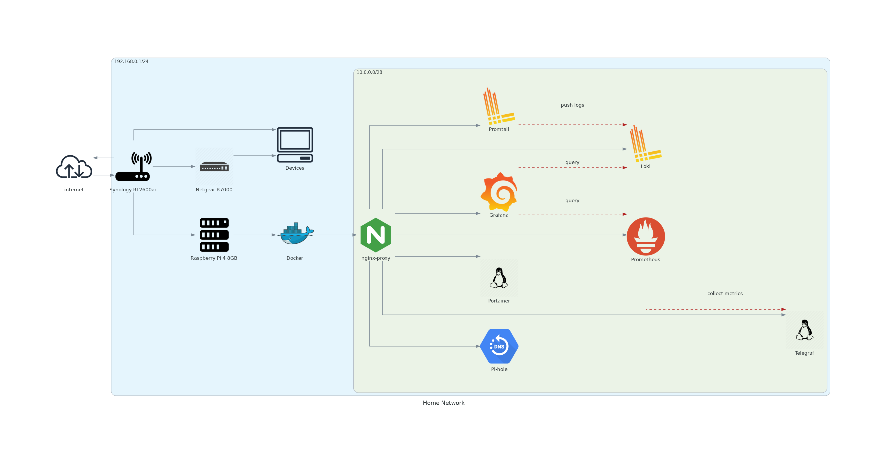

# Home Network Diagram

This generates the infrastructure diagram using the python library [diagrams](https://github.com/mingrammer/diagrams).



## Getting Started

Python 3.6+ and [GraphViz](https://graphviz.gitlab.io/download/) are required.

```bash
# First create a python virtual environment.
$ python3 -m venv .venv

# Install GraphViz if it's not already installed.
$ sudo apt install graphviz -y
```

## Generating

```bash
# Execute generate.py, note this requires the python virtual environment to have already been created.
$ ./generate.py
```
